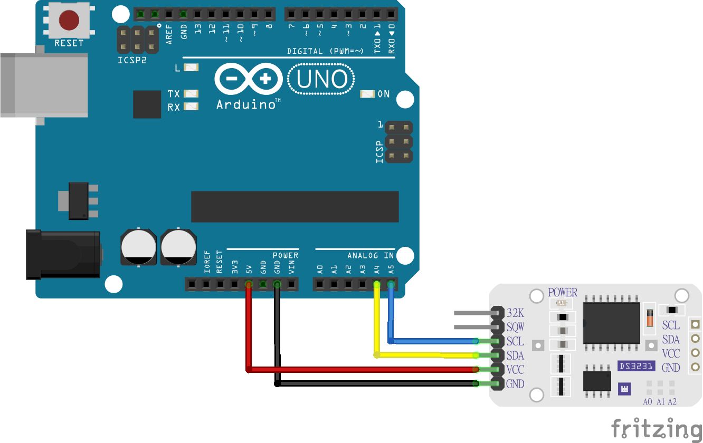

# Whadda RTC DS3231 module example code

This example shows how you can use the Whadda RTC DS3231 module (WPM352) with an Arduino® compatible board to set and retrieve the current time using the serial monitor.

## Library dependencies
*  DS3231 library by Andrew Wickert, Eric Ayars, Jean-Calude Wippler, Northern widget LLC 

## Wiring diagram

## Usage

1. Upload the **set_time** sketch and follow the instructions in the serial monitor to set the current time.
2. Upload the **display_time** sketch to get a print-out of the current time from the RTC module in the serial monitor

## Additional information
  For more information about the hadda RTC DS3231 module (WPM352), check the manual available at [whadda.com](https://whadda.com)

## Acknowledgments
Based on DS3231 library example files
by Eric Ayars and Andy Wickert (2011)

URL: https://github.com/NorthernWidget/DS3231